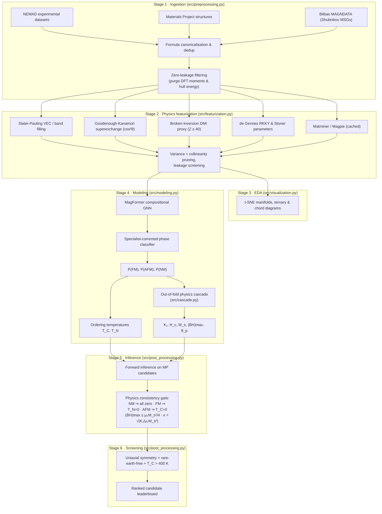

# Physics-Informed Machine Learning for Magnetic Materials Discovery

[](https://www.python.org/)
[](LICENSE)
[-orange.svg)](https://doi.org/10.1038/s41467-024-55500-7)

An end-to-end pipeline that learns eight magnetic properties from experimental
NEMAD data, then screens Materials Project alloys for rare-earth-free permanent
magnets.

**The central result is that domain physics descriptors matter enormously for
the hysteresis and moment properties, and essentially not at all for magnetic
ordering.** Composition alone already predicts the Curie temperature
($R^2 = 0.78$), the Néel temperature ($0.74$) and the magnetic phase ($89.8\%$).
It predicts saturation magnetisation and coercivity *not at all*
($R^2 \approx 0$) — those need Goodenough-Kanamori superexchange, spin-orbit
coupling and Slater-Pauling band filling, which lift the same learners to $0.54$
and $0.62$. Where the physics helps, and where it does not, is the finding.

---

## 1. What the physics descriptors are worth

Five-fold `GroupKFold` on `reduced_formula`, blend weights fitted on inner
out-of-fold predictions, out-of-fold cross-target cascade.

| Target | F1 composition only | F3 + physics | F5 + proxies | physics worth |
| :--- | ---: | ---: | ---: | ---: |
| **Ordering & phase** | | | | |
| Phase classification (acc) | 0.8984 | 0.9016 | 0.8992 | ~0 |
| Curie temperature $T_C$ | 0.7778 | 0.7930 | **0.8157** | +0.04 |
| Néel temperature $T_N$ | **0.7406** | 0.7407 | 0.7301 | ~0 |
| **Moment & hysteresis** | | | | |
| Curie-Weiss $\theta_p$ | 0.513 | 0.607 | 0.596 | +0.08 |
| Anisotropy $K_1$ | 0.054 | **0.309** | 0.310 | **+0.26** |
| Energy product $(BH)_{\max}$ | 0.080 | **0.478** | 0.494 | **+0.41** |
| Saturation magnetisation $M_s$ | −0.001 | **0.536** | 0.545 | **+0.55** |
| Coercivity $H_c$ | −0.000 | **0.620** | 0.622 | **+0.62** |

Four things follow, and the manuscript should say all four:

1. **The split is the result.** Ordering temperatures and phase are set by which
   magnetic elements are present and in what proportion, which element fractions
   already encode. Hysteresis and moment properties depend on band filling,
   spin-orbit coupling and anisotropy, which they do not.
2. **F1 → F3 supplies everything for $M_s$, $H_c$, $K_1$ and $(BH)_{\max}$.**
   The composition-only baseline explains none of their variance.
3. **F3 → F5 adds ~0.01**, except for $T_C$ (+0.023). The proxy tier is *worse*
   than F3 for $T_N$ and phase classification and should not be claimed as a
   separate contribution.
4. **The cross-target cascade is a wash for accuracy.** It is retained because it
   enforces physical consistency at inference, not because it improves scores.

One caveat on the $M_s$ row: F1 contains `Average_Weight`, which is zero
throughout the master table. Since $\sigma\,[\text{emu/g}] = 5585\,n_{\mu_B}/\bar{M}$,
a composition-only model with no working mass descriptor is structurally unable
to predict emu/g, so $-0.001$ overstates the deficit. `modeling.py` now recovers
$\bar{M}$ from the formula, but the persisted feature table still carries zeros;
the row needs a Stage 2 rerun before it is quoted.

Reproduce the ablation with:

```bash
MAGPIPE_MODE=final_manuscript python run_pipeline.py --stage 4   # full 8-target ablation
python benchmark_targets.py --mode final_manuscript --n-splits 5 # extended targets only
```

Results are written to `output/benchmarks/extended_targets_benchmark.json`, with
per-fold scores, bootstrap 95% CIs and the run configuration attached.

---

## 2. Pipeline



### Stage detail

**Stage 1 — Ingestion.** Unifies the phase, $T_C$ and $T_N$ datasets; maps
formulas to space groups, crystal systems and point groups via Materials Project
and Bilbao MAGNDATA. Post-synthesis and DFT-calculated target properties are
purged from the feature matrix. Formula families are tracked so `GroupKFold`
keeps every polymorph of a composition on one side of the split.

**Stage 2 — Featurisation.** ~450 descriptors. The physics block (the one that
matters, see §1) covers Slater-Pauling band filling relative to $N_v \approx 8.3$;
Goodenough-Kanamori transfer factors $\cos^2\theta$ with cation-anion
electronegativity differences; a DMI symmetry proxy
$D \propto \mathbb{I}(\text{non-centrosymmetric}) \sum_i x_i (Z_i/100)^4$;
de Gennes $(g_J-1)^2 J(J+1)$ RKKY scaling; and Stevens crystal-field operator
equivalents for single-ion anisotropy.

**Stage 4 — Modeling.** Compositional GNN → specialist-corrected phase classifier
→ temperature regressors → extended physical targets, coupled through an
out-of-fold cascade.

**Stages 5–6 — Inference and screening.** Physics gating, critical-raw-material
penalty, magnetic hardness $\kappa = \sqrt{K_1/\mu_0 M_s^2}$, and a
multi-objective discovery score.

---

## 3. Targets and data

Metrics below are five-fold `GroupKFold`, `MAGPIPE_MODE=final_manuscript`,
out-of-fold cascade, from `output/training/stage3_modeling.json`
(`run_config.is_publishable: true`).

| # | Target | Unit | Transform | $n$ | Score | Error | Fold spread |
| :--- | :--- | :--- | :--- | ---: | ---: | ---: | ---: |
| 1 | Phase ground state | FM/AFM/NM | discrete | 35,045 | 0.9186 acc | 0.9075 macro F1 | AFM F1 0.8234 |
| 2 | Curie temperature $T_C$ | K | linear | 15,518 | 0.8157 $R^2$ | 69.82 K | — |
| 3 | Néel temperature $T_N$ | K | linear | 7,734 | 0.7301 $R^2$ | 48.59 K | — |
| 4 | Anisotropy $K_1$ | J/m³ | symlog | 3,938 | 0.2693 $R^2$ | 1.723 dex | ± 0.024 |
| 5 | Coercivity $H_c$ | A/m | log₁₀ | 6,980 | 0.5963 $R^2$ | 0.650 dex | ± 0.023 |
| 6 | Saturation magnetisation $M_s$ | emu/g | linear | 7,619 | 0.5385 $R^2$ | 26.09 emu/g | ± 0.027 |
| 7 | Energy product $(BH)_{\max}$ | kJ/m³ | log₁₀ | 1,379 | 0.5069 $R^2$ | 0.265 dex | **± 0.109** |
| 8 | Curie-Weiss intercept $\theta_p$ | K | linear | 5,474 | 0.5505 $R^2$ | 64.66 K | ± 0.104 |

Per-class $F_1$ for Target 1: FM 0.9188, NM 0.9804, **AFM 0.8234**. AFM is the
hard class, as expected — it is the one requiring exchange-sign information.

Labelled counts in `features_master.csv` exceed the usable counts above for
targets 4–7 (K₁ 4,962; H_c 9,975; M_s 10,212; (BH)max 1,983) because
`GroupKFold` requires a `reduced_formula` and canonicalisation fails on a
sizeable minority of NEMAD formula strings — see §6.

Both columns are counted in `output/featurization/features_master.csv`:
"labelled" is rows with a valid value, "usable" additionally requires a
`reduced_formula`, which `GroupKFold` needs. The gap in targets 4–7 is a
formula-canonicalisation failure, not missing measurements — see §6. Actual
per-target training counts are recorded in `stage3_modeling.json`, and can be
smaller still where a target is joined against a narrower feature frame (this is
the case for $T_N$).

### Magnetocrystalline anisotropy needs a decomposition, not one number

$K_1$ is the weakest target, and a single symlog $R^2$ obscures why. Sign is a
discrete symmetry outcome (easy-axis vs easy-plane); magnitude is a spin-orbit
energy scale. Regressing symlog across a sign change conflates them. Reported
separately, on the physically admissible window $1 \le |K_1| \le 10^8$ J/m³:

| Formulation | $R^2$ | MAE |
| :--- | ---: | ---: |
| symlog $K_1$, all records | 0.310 ± 0.035 | 1.657 dex |
| symlog $K_1$, physical window | 0.255 ± 0.046 | 1.487 dex |
| **$\log_{10}\|K_1\|$, physical window** | **0.461 ± 0.015** | **0.949 dex** |
| sign classifier (macro $F_1$) | 0.647 | — |
| recombined two-stage | −0.079 ± 0.132 | 1.557 dex |

Magnitude alone reaches $R^2 = 0.46$ at 0.95 dex — a decade of error rather than
1.7. The sign classifier at $F_1 = 0.65$ is weak (the data is 89% easy-axis), and
recombining the two is *worse than either*, because a flipped sign produces an
enormous symlog error. **Report magnitude and sign separately; do not recombine.**

The $R^2$ drop when the physical window is applied is expected and not a
regression: 13% of `clean_K1_J_m3` lies below 1 J/m³, down to $10^{-24}$, which
is impossible for an anisotropy constant and is almost certainly unconverted
units. Removing it shrinks the variance $R^2$ is measured against while
*improving* absolute error.

---

## 4. Model architectures

**MagFormer compositional GNN** (`src/composition_gnn.py`) — stoichiometry graph,
no 3D positions. Element nodes carry $Z$, electronegativity, covalent radius,
valence and Stoner parameter; attention pooling weighted by stoichiometric
fraction; three heads (phase, $\log T_C$, $\log T_N$) supplying priors downstream.

**Specialist-corrected classifier** (`SpecialistCorrectedClassifierEnsemble`) —
a global multiclass stack (ExtraTrees + RF + LightGBM + XGBoost + CatBoost +
meta-logistic) plus an FM/AFM specialist trained only on near-boundary materials.
When $P(\text{FM}) \approx P(\text{AFM})$ and $P(\text{NM}) < 0.40$, the
specialist is mixed in; otherwise the global stack is used unchanged.

**Target-balanced temperature regressors** — resampling across the <150 K,
150–500 K and >500 K regimes, cascaded out-of-fold class probabilities and GNN
priors as extra inputs, non-negative meta-weighting, ensemble spread as an
epistemic uncertainty.

**Transformed physical regressors** for targets 4–8 — symlog ($K_1$), log₁₀
($H_c$, $(BH)_{\max}$), linear ($M_s$, $\theta_p$), with Slater-Pauling and
thermodynamic ceilings enforced on inversion.

**Physics cascade** (`src/cascade.py`) — $K_1$, $M_s$ and $H_c$ predictions feed
the Kronmüller and Stoner-Wohlfarth relations that define $H_c$ and
$(BH)_{\max}$. Every donor value consumed by a downstream target is out-of-fold
with respect to that compound's own label.

---

## 5. Reproducibility

Run capacity is set by `MAGPIPE_MODE`, never by editing constants:

```bash
MAGPIPE_MODE=final_manuscript python run_pipeline.py --stage 4
```

| Preset | Folds | Estimators | GNN epochs | Ablation | Publishable |
| :--- | ---: | ---: | ---: | :--- | :--- |
| `fast_debug` | 3 | 120 | 10 | off | no |
| `development` | 3 | 300 | 15 | off | no |
| `final_manuscript` | 5 | 600 | 40 | on | yes |

Every metrics file embeds a `run_config` provenance block. Reduced-capacity runs
are stamped `is_publishable: false`, and `RunConfig.assert_publishable()` refuses
to certify them. Model caches carry a `.config.json` sidecar and are rejected if
the configuration that produced them differs, so a debug artefact cannot survive
into a full-capacity run.

Guards enforced in code:

- Blend weights are fitted on inner out-of-fold predictions, never on validation labels.
- Cross-target cascade features are out-of-fold (`cascade_out_of_fold`).
- `FORBIDDEN_FEATURE_COLUMNS` blocks the raw pre-cleaning target columns that
  remain in `features_master.csv` at $\rho = 1.0$ with their `clean_*`
  counterparts (`K1_J_m3`, `Coercivity_A_m`, `Saturation_Magnetization_emu_g`,
  `Hard_Magnet`). Selecting features by dtype without this screen yields
  $R^2 \approx 0.99$ — a trap that looks like a triumph.
- Untrained ablation tiers are recorded as `not_evaluated` and never back-filled
  from another tier.

---

## 6. Known limitations

**~25–30% of extended-target data is discarded.** `reduced_formula` is null for
2,995 $H_c$, 2,593 $M_s$, 1,011 $K_1$ and 604 $(BH)_{\max}$ records, and
`GroupKFold` requires it. These are canonicalisation failures on messy NEMAD
formula strings, not missing measurements. `src/data_recovery.py` exists to
sanitise exactly these strings but is **not wired into any pipeline stage**.
Recovering them would take $(BH)_{\max}$ from 1,379 to 1,983 samples (+44%) —
the target that most needs it.

**$(BH)_{\max}$ is unstable.** Fold-to-fold standard deviation is ±0.109 on a
pooled $R^2$ of 0.507, at $n = 1379$; the bootstrap 95% CI is [0.459, 0.554].
Quote the interval, not the point estimate. $\theta_p$ is nearly as unstable
(±0.104).

**Target 1 metrics changed substantially when the pipeline was run at full
capacity.** Earlier reported values (98.30% accuracy, 0.9810 macro $F_1$, 0.9710
AFM $F_1$) came from a `fast_debug` run and do not reproduce; the five-fold
`final_manuscript` result is 0.9186 / 0.9075 / 0.8234. The earlier run recorded
no configuration provenance, and the cached feature file it loaded has since
been overwritten, so the discrepancy could not be fully attributed. Feature
sifting and the sweep below are the leading candidates.

**Model selection is not nested.** Two related issues affect Target 1:
`select_stable_optimized_features` is called on the full `X, y` outside the CV
loop that reports the score, so the surviving 60–100 features are chosen with
access to every label; and the sweep over feature type, top-$k$, hard-multiplier
and three specialist boundary thresholds spans 864 configurations in
`final_manuscript` mode, with the winner chosen by
$0.4\,\text{acc} + 0.3 F_1^{\text{macro}} + 0.3 F_1^{\text{AFM}}$ computed on the
same out-of-fold predictions that are then published. The reported figure is
therefore the maximum of 864 correlated estimates, not an unbiased one. Fixing
this requires nesting the sifting inside each outer fold and holding out a
selection split for the sweep; both will lower the reported number.

**The classifier's multi-representation blend requires the ablation.** The
F1/F3/F5 blend at weights 0.40/0.25/0.35 is only meaningful when those tiers are
actually trained; in single-representation mode the pipeline uses F5 directly and
says so, rather than averaging three copies of one array.

**Residual in-sample coupling.** `cascade_pred_TC` and `cascade_prob_FM` are
still injected into targets 4–8 from full-fit classifier and temperature models.
The donor cascade ($K_1$, $M_s$, $H_c$) is out-of-fold; this part is not yet.

**The Stevens torque proxy is not calibrated.** `stevens_k1_torque` is in
arbitrary Stevens units ~8 orders of magnitude below J/m³. Where no predicted
$K_1$ is available, `pinn_hysteresis.py` bridges it with a fixed round constant
so the Stoner-Wohlfarth relations land in a physical range. Tree learners are
invariant to the monotone rescaling, but the absolute PINN bounds from that
fallback path should not be read as physical values.

---

## 7. Installation and usage

```bash
pip install numpy pandas scipy scikit-learn lightgbm xgboost catboost pymatgen matminer torch
```

```bash
# Full pipeline at manuscript capacity
MAGPIPE_MODE=final_manuscript python run_pipeline.py --stage all

# Individual stages
python run_pipeline.py --stage 4    # training and cross-validation
python run_pipeline.py --stage 5    # inference on candidate pool
python run_pipeline.py --stage 6    # sustainable magnet screening

# Representation benchmark (writes output/benchmarks/)
python benchmark_targets.py --mode final_manuscript --n-splits 5

# Single-formula inference
python run_pipeline.py --predict "Nd2Fe14B"
```

---

## 8. Repository layout

```
ML_pipeline/
├── run_pipeline.py              # CLI orchestrator
├── benchmark_targets.py         # representation benchmark → output/benchmarks/
├── src/
│   ├── config.py                # RunConfig, presets, leakage screen
│   ├── evaluation.py            # per-fold metrics, bootstrap CIs, leak-free blending
│   ├── cascade.py               # out-of-fold cross-target physics cascade
│   ├── preprocessing.py         # Stage 1
│   ├── featurization.py         # Stage 2
│   ├── visualization.py         # Stage 3
│   ├── modeling.py              # Stage 4
│   ├── post_processing.py       # Stages 5–6
│   ├── composition_gnn.py       # MagFormer GNN
│   ├── pinn_hysteresis.py       # Stoner-Wohlfarth / Kronmüller bounds
│   ├── stevens_operator.py      # crystal-field anisotropy features
│   ├── mace_featurizer.py       # MACE-MP-0 / JARVIS descriptors
│   ├── data_recovery.py         # formula sanitisation (NOT yet wired in — §6)
│   ├── generative_screening.py  # inverse design
│   └── utils.py                 # constants, palettes, plotting
├── Dataset/                     # experimental datasets & MP crystal data
├── output/                      # features, models, predictions, benchmarks
└── plots/                       # figures
```

---

## 9. Citation

```bibtex
@article{nemad2025,
  title={A non-equilibrium magnetic materials database and machine learning
         framework for magnetic materials discovery},
  journal={Nature Communications},
  year={2025},
  doi={10.1038/s41467-024-55500-7}
}
```
