# MagMat: Physics-Grounded Screening & Inverse Discovery Guide

**Author:** Sachin Poudel  
**Platform:** MagMat Screening & Discovery Studio  

---

## 1. Executive Summary & Core Philosophy

Permanent magnets are vital components of modern clean energy technologies—from electric vehicle (EV) traction drive motors to offshore direct-drive wind turbine generators. Today's highest-performing commercial magnets depend heavily on critical rare-earth elements (principally Neodymium, Dysprosium, and Terbium) that suffer from volatile supply chains and severe environmental extraction footprints.

Discovering sustainable, rare-earth-free alternatives (such as ordered $\text{L1}_0\text{-FeNi}$, $\tau\text{-MnAl}$, or $\text{Fe}_{16}\text{N}_2$) typically involves slow, expensive trial-and-error synthesis or computationally heavy DFT simulations. Machine learning accelerates this search, but pure black-box models risk proposing materials that violate basic laws of electromagnetism.

> **The Core Philosophy:**  
> Before trusting any predictive model, we benchmark compositions against **fundamental condensed-matter physics ceilings** derived directly from stoichiometry. We then combine these physical limits with **trained multi-task machine learning ensembles** and **pretrained 3D atomistic foundation AI** in an interactive inverse-discovery loop.

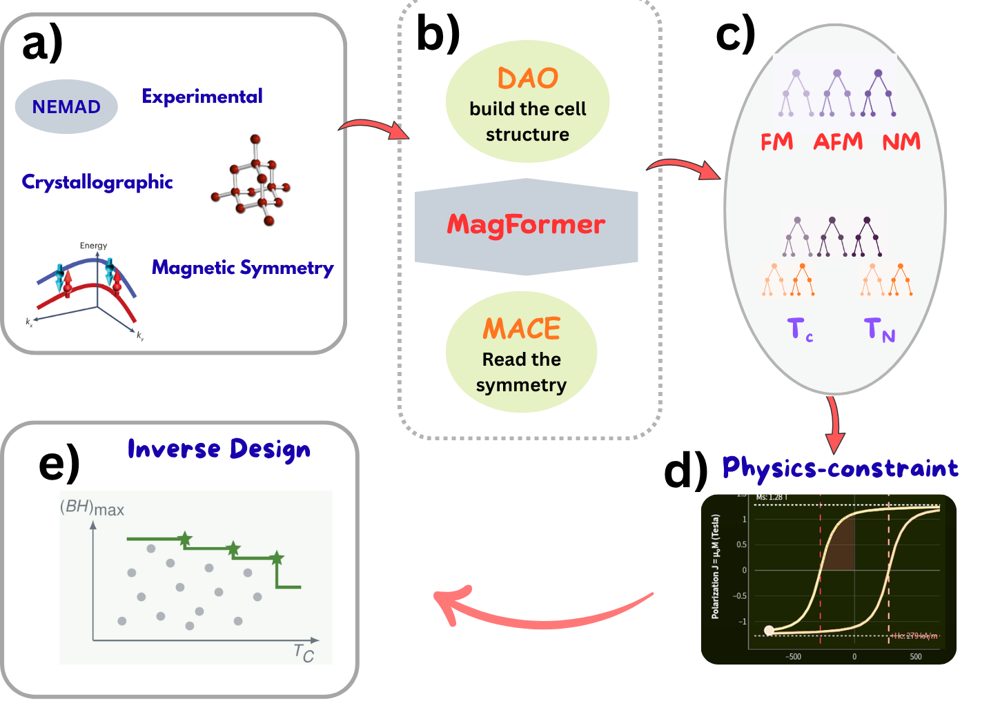
*Figure 1: Integrated screening and inverse-design workflow: (a) Experimental datasets from NEMAD and literature with crystallographic and magnetic symmetry; (b) 3D structural AI: DAO diffusion (cell structure and $E_{\text{hull}}$ stability), MagFormer compositional transformer, and MACE equivariant symmetry; (c) Trained ML models: Phase classification (FM / AFM / NM) and dynamic transition temperature prediction ($T_C, T_N$); (d) Physics-constraint benchmarking (Kronmüller, Slater-Pauling, Maxwell); (e) Multi-objective inverse Pareto discovery ($(BH)_{\max}$ vs $T_C$).*

---

## 2. The Four Analytical Condensed-Matter Ceilings

We implement four classical condensed-matter rules that establish hard upper bounds directly from stoichiometry and crystal physics. **These rules contain no tunable fitting parameters and are grounded in fundamental physical laws**, providing transparent theoretical guardrails.

| # | Condensed-Matter Bound | Fundamental Question Answered | Physical Mechanism & Governing Equation |
|---|---|---|---|
| **1** | **Slater–Pauling Band Ceiling** | *What is the maximum magnetization possible?* | Electrons fill spin-up $3d$ states until the majority sub-band is full at valence electron count $\text{VEC} \approx 8.3$ ($\text{Fe}_{70}\text{Co}_{30}$ peak at $2.45\,\mu_B/\text{atom}$). Additional electrons enter spin-down states, cancelling magnetic moment: <br> $\bar{\mu}_s = 2.45 - 0.875(8.3 - N_v)$ |
| **2** | **Stoner Criterion** | *Can this composition sustain ferromagnetism?* | Ferromagnetic exchange spontaneous ordering occurs only when intra-atomic exchange energy outweighs the kinetic band-widening cost: <br> $I \cdot D(E_F) > 1$ |
| **3** | **Kronmüller Micromagnetics** | *How hard can this crystal resist demagnetization?* | In an ideal single crystal, coherent rotation requires the nucleation field: <br> $H_K = \frac{2K_1}{\mu_0 M_s}$ <br> In real polycrystals, grain boundaries and defects nucleate early reverse domains, resulting in an **89% deficit** ($\alpha \approx 0.11$). |
| **4** | **Maxwell Thermodynamic Bound** | *What is the maximum energy product $(BH)_{\max}$?* | Magnetostatics dictates that an ideal square hysteresis loop cannot store more energy than: <br> $(BH)_{\max} \le \frac{1}{4}\mu_0 M_s^2$ |

---

## 3. Pillar 1: The Slater–Pauling Atomic Band Ceiling

The **Slater–Pauling curve** connects the mean magnetic moment per atom $\bar{\mu}_s$ (in Bohr magnetons $\mu_B$) to the valence electron concentration ($\text{VEC}$, valence electrons per atom).

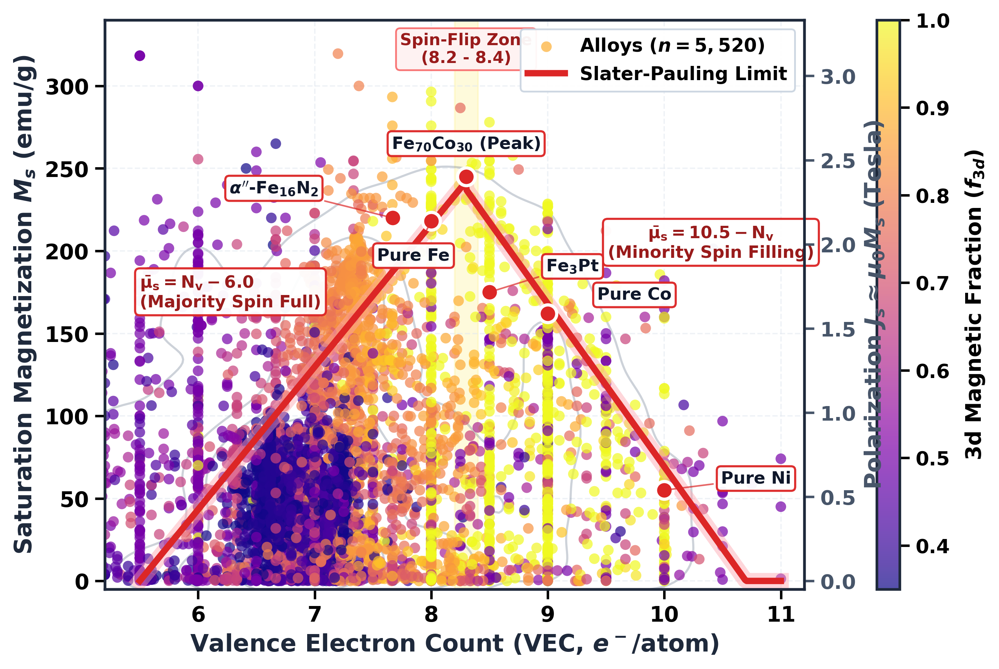

### Key Insights from the Data:
- **Fe–Co sits at the peak:** $\text{Fe}_{70}\text{Co}_{30}$ achieves the global ceiling of $2.45\,\mu_B/\text{atom}$ ($M_s \approx 245\text{ emu/g}$ or $\mu_0 M_s \approx 2.45\text{ T}$).
- **Ceiling, Not Regressor:** The curve acts as a strict upper bound. Real alloys sit *beneath* the envelope because spin canting, antiferromagnetic sub-lattices, and ligand dilution in non-metallic phases suppress net magnetic moments.
- When an experimental measurement appears above this boundary, it immediately flags bad or non-equilibrium data.

---

## 4. Pillar 2: The 89% Microstructural Defect Gap

While saturation magnetization is an **intrinsic property** dictated almost entirely by chemical composition and atomic orbitals, coercivity ($H_c$) is an **extrinsic property** governed by crystal defects, grain boundaries, and surface nucleation sites.

````carousel
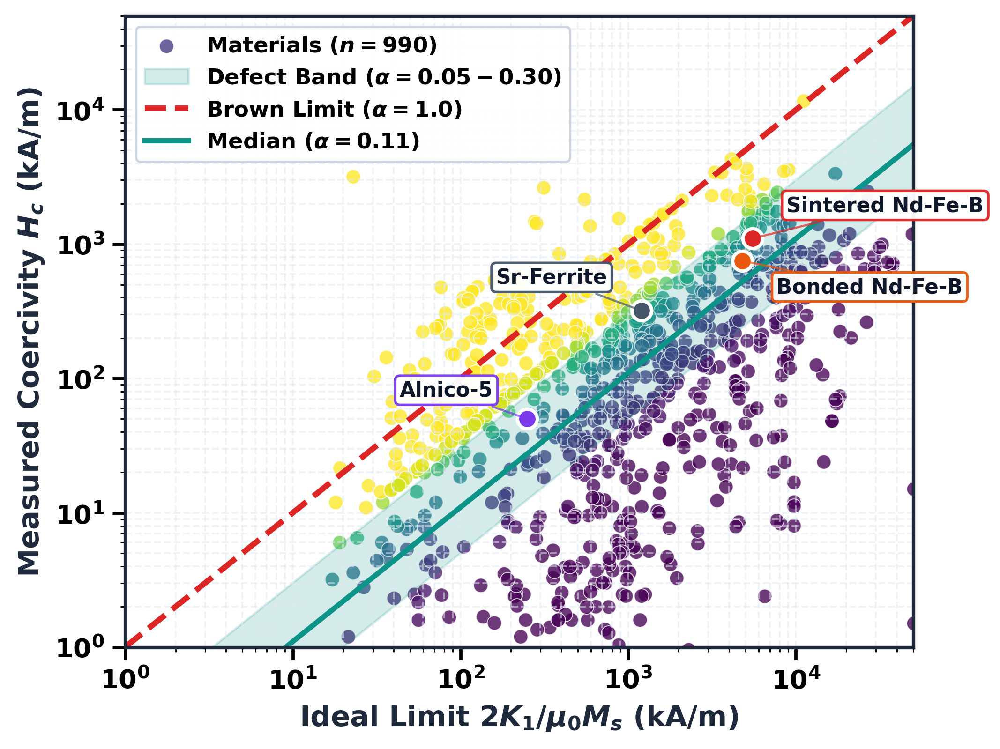
<!-- slide -->
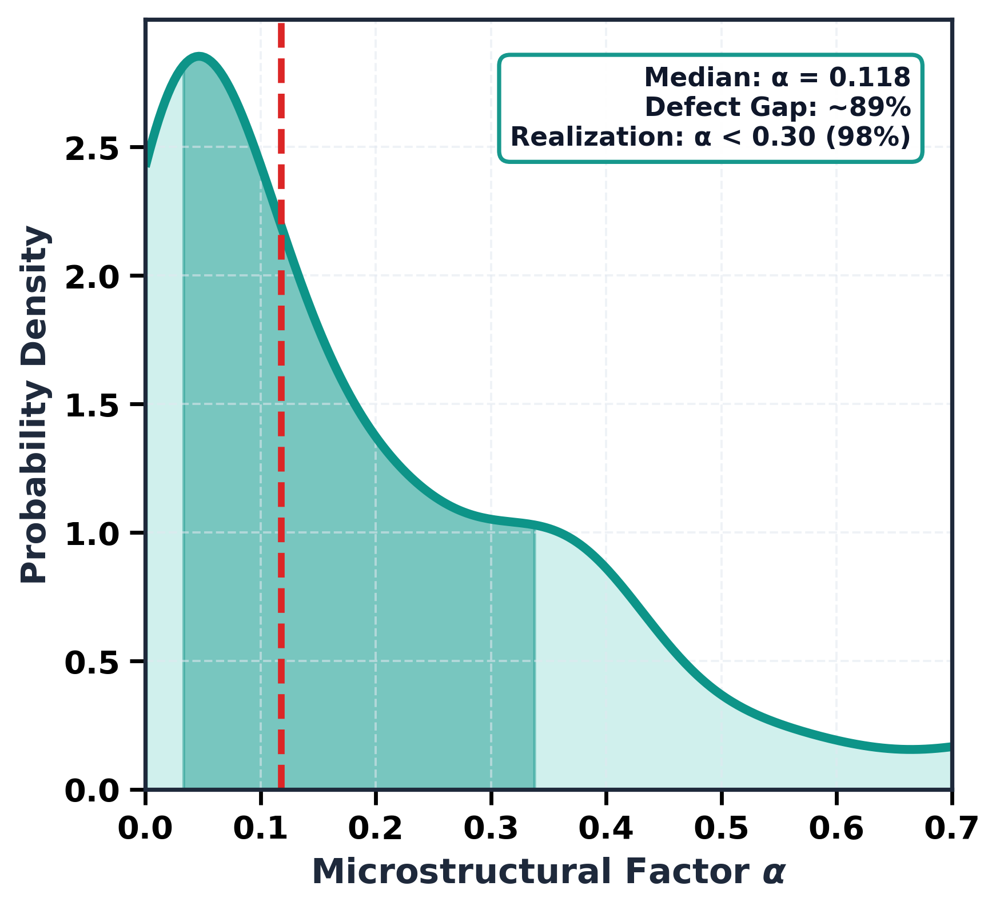
````

### Understanding the Reality Gap ($\alpha \approx 0.11$):
- **Brown's Paradox:** While an ideal defect-free crystal requires a reverse field of $H_K = \frac{2K_1}{\mu_0 M_s}$ to flip magnetization, experimental sintered and bonded magnets flip at fields one to two orders of magnitude lower.
- **Kronmüller scaling:** $H_c^{\text{actual}} = \alpha \frac{2K_1}{\mu_0 M_s} - N_{\text{eff}} M_s$
- **The Empirical Reality:** Across 1,064 matched experimental records in our database, the median microstructural realization factor is **$\alpha = 0.118$**.
- **The Conclusion:** **89% of potential coercivity is missing.** This missing headroom cannot be captured by a chemical formula alone; it requires explicit **3D atomistic structure, local site symmetry, and grain morphology**.

---

## 5. Experimental Data Landscape across 56,781 Records

MagMat-Concept harmonizes 56,781 experimental measurements from the NIMS Electronic and Magnetic Alloy Database (NEMAD), Landolt–Börnstein handbooks, and primary literature.

````carousel
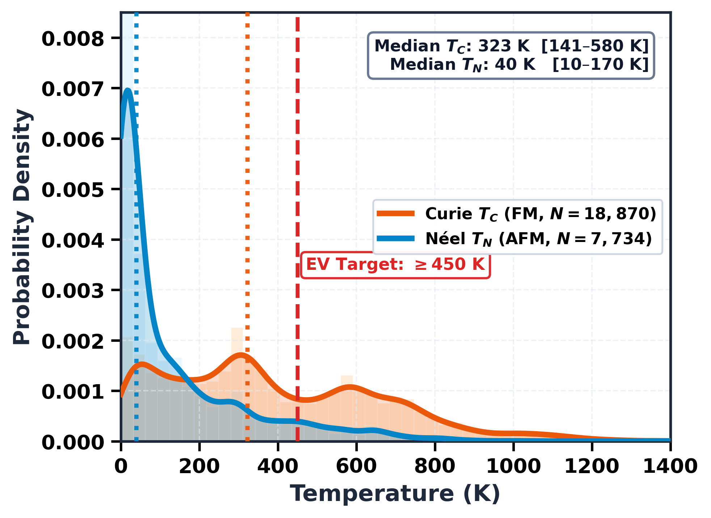
<!-- slide -->
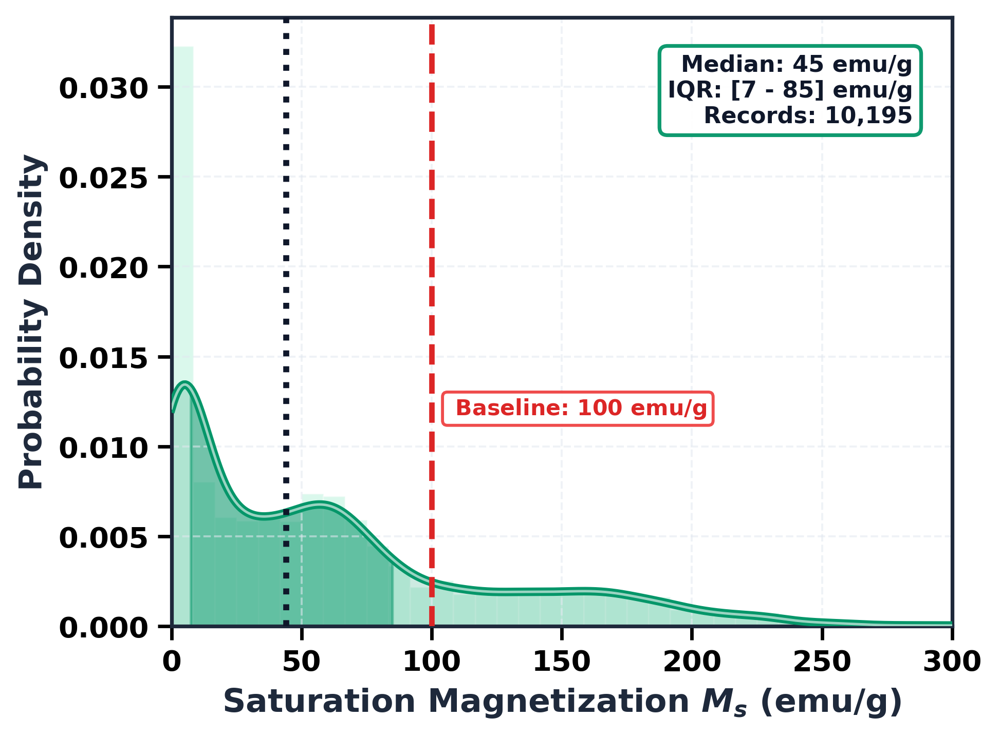
<!-- slide -->
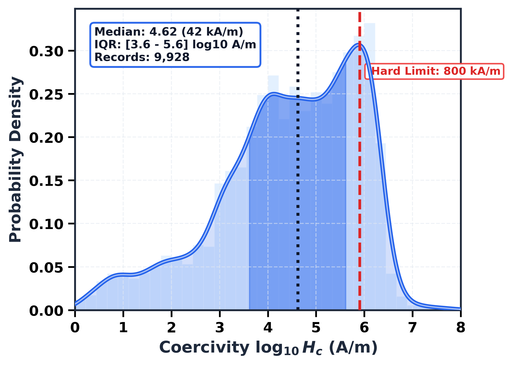
<!-- slide -->
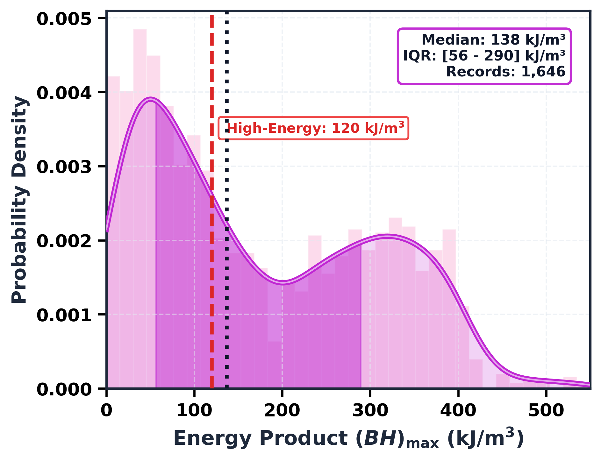
````

### Dataset Statistics Overview

| Target Property | Units | Records | Median Value | Target Milestone | Rare-Earth Free Share |
|---|---|---|---|---|---|
| **Curie Temperature ($T_C$)** | $\text{K}$ | 18,860 | 323.0 K | $\ge 450\text{ K}$ (Thermal stability in motors) | 45.5% |
| **Néel Temperature ($T_N$)** | $\text{K}$ | 7,734 | 40.0 K | Antiferromagnetic transition | 40.4% |
| **Saturation Magnetization ($M_s$)** | $\text{emu/g}$ | 10,131 | 44.8 emu/g | $\ge 100\text{ emu/g}$ ($\mu_0 M_s \ge 1.0\text{ T}$) | 71.4% |
| **Coercivity ($H_c$)** | $\text{A/m}$ | 9,935 | $4.22\times 10^4$ A/m | $\ge 8.0\times 10^5\text{ A/m}$ (Hard magnet) | 65.3% |
| **Magnetocrystalline Anisotropy ($K_1$)** | $\text{J/m}^3$ | 4,582 | $4.80\times 10^3$ J/m$^3$ | $\ge 1.0\times 10^6\text{ J/m}^3$ (Uniaxial locking) | 72.2% |
| **Maximum Energy Product ($(BH)_{\max}$)** | $\text{kJ/m}^3$ | 1,658 | 138.5 kJ/m$^3$ | $\ge 120\text{ kJ/m}^3$ (Commercial viability) | 34.4% |

### Correlation Drivers

````carousel
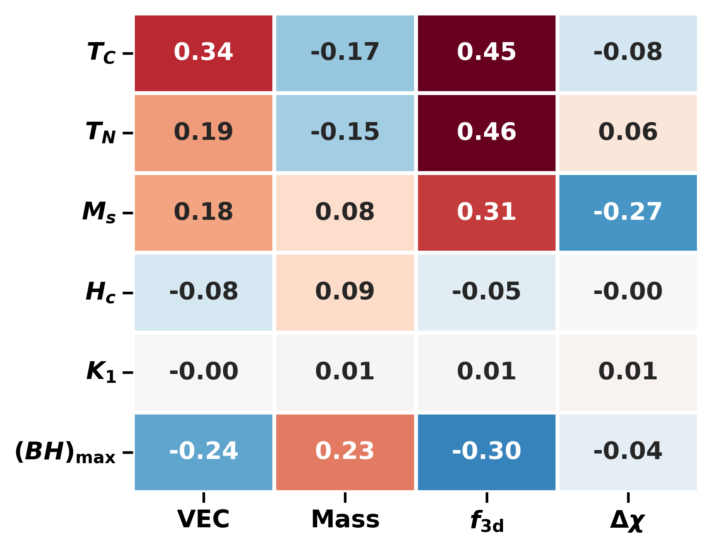
<!-- slide -->
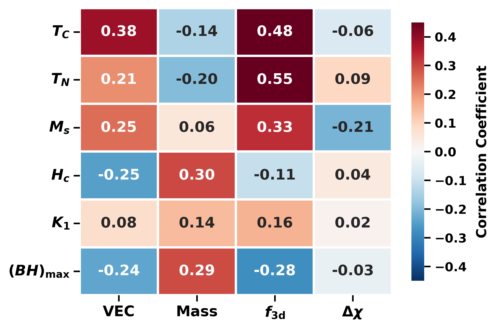
````

- **Transition-Metal Fraction ($f_{3d}$):** Strongly drives Curie temperature ($r = 0.45$) and saturation magnetization ($r = 0.31$) through direct $3d\text{--}3d$ quantum exchange.
- **Rare-Earth Concentration ($f_{\text{RE}}$):** Dominates magnetocrystalline anisotropy ($K_1$) and coercivity ($H_c$) through localized $4f$ orbital moments and strong spin-orbit coupling.
- **Valence Electron Count ($\text{VEC}$):** Positively influences transition temperatures ($r = 0.34$) but shows a negative correlation with energy product ($(BH)_{\max}$, $r = -0.24$) due to trade-offs between moment and coercivity.

---

## 6. Trained Machine Learning Pipeline & Foundation AI

To bridge the gap between abstract physics ceilings and realistic experimental performance, MagMat-Concept integrates the production machine learning pipeline from **MagMat-Discovery**.

```
Input Formula & Symmetry
        │
        ├──► [Trained Classifier] ──► Magnetic Phase: FM / AFM / NM (91.9% Accuracy)
        │
        ├──► [Trained Regressors] ──► Curie Temp TC, Néel Temp TN, Ms, K1, Hc, (BH)max
        │                             + 90% Conformal Calibration Intervals
        │
        ├──► [DAO Diffusion AI]   ──► Relaxed 3D Crystal Unit Cell + Ehull Stability (< 0.1 eV/atom)
        │
        ├──► [MACE Transformer]   ──► E(3)-Equivariant Site Symmetries (Resolves Polymorphs)
        │
        └──► [Physics Ceilings]   ──► Slater-Pauling, Stoner, Kronmüller (Hk), Maxwell Bounds
```

### 1. Magnetic Phase Classification & Dynamic Temperature Routing
- **Trained Classifier (`phase_clf`):** Predicts ground-state magnetic ordering (**Ferromagnetic**, **Antiferromagnetic**, or **Non-Magnetic**) with **91.9% accuracy** and **0.908 Macro $F_1$**.
- **Dynamic Routing:**
  - If **FM**: Evaluates the trained $T_C$ model ($N=18,860, R^2=0.816$) and displays **Curie Point $T_C$**.
  - If **AFM**: Evaluates the trained $T_N$ model ($N=7,734, R^2=0.741$) and displays **Néel Point $T_N$**.
  - If **NM**: Suppresses net magnetic properties to zero.

### 2. Multi-Model Regressor Ensembles & Conformal Uncertainty
- Combines five top-tier gradient-boosted and tree regressors: **LightGBM, XGBoost, CatBoost, ExtraTrees, and Random Forests**.
- Applies **non-parametric conformal prediction** to calculate distribution-free 90% confidence intervals, providing honest error bars rather than overconfident point estimates.

### 3. Pretrained 3D Structural Foundation Models
- **DAO (Diffusion for Atomistic Ordering):** Generates relaxed 3D crystal structures directly from stoichiometry and computes energy above the convex hull ($E_{\text{hull}}$) to filter thermodynamically unstable compositions.
- **MACE ($E(3)$-Equivariant Transformer):** Encodes 3D coordination polyhedra, bond angles, and site symmetries. This solves the **polymorph dilemma**: ferromagnetic $\tau\text{-MnAl}$ and non-magnetic $\beta\text{-MnAl}$ share the exact same chemical formula, and can only be distinguished through 3D structural AI.

---

## 7. Inverse Target Discovery & The Pareto Frontier

Instead of guessing formulas and testing them one by one, MagMat-Concept allows researchers to set target engineering specifications and discover materials that satisfy them simultaneously:

$$\text{Targets: } (BH)_{\max} \ge 120\text{ kJ/m}^3, \quad T_C \ge 450\text{ K}, \quad \text{Rare-Earth Free}$$

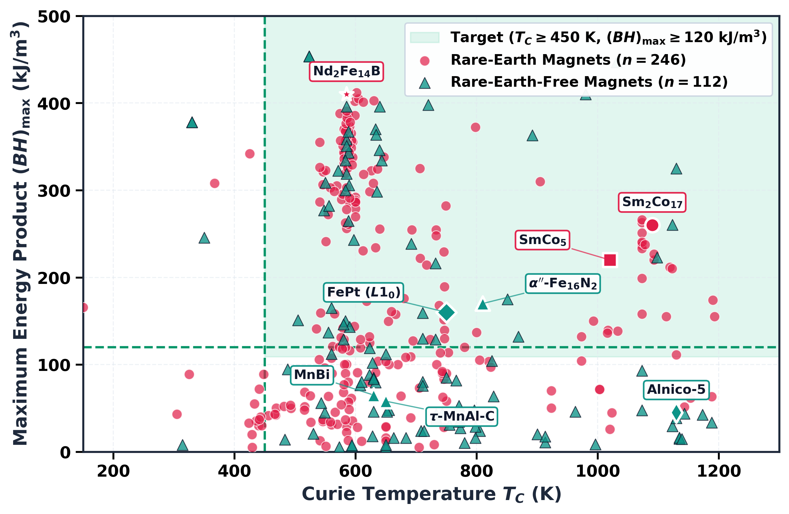

### Promising Rare-Earth-Free Candidates on the Pareto Frontier:
1. **$\text{FeNi (L1}_0\text{ "Tetrataenite")}$:** High energy product ceiling ($(BH)_{\max} \approx 335\text{ kJ/m}^3$) and $T_C \approx 820\text{ K}$, limited primarily by the slow atomic ordering kinetics in lab synthesis.
2. **$\tau\text{-MnAl}$:** Metastable ferromagnetic phase ($T_C \approx 650\text{ K}, (BH)_{\max} \approx 60\text{--}80\text{ kJ/m}^3$), free of critical elements.
3. **$\text{Fe}_{16}\text{N}_2$:** Giant saturation magnetization candidate with high theoretical energy product.

---

## 8. The Interactive Web Platform

The complete workflow runs interactively in your browser via Streamlit:

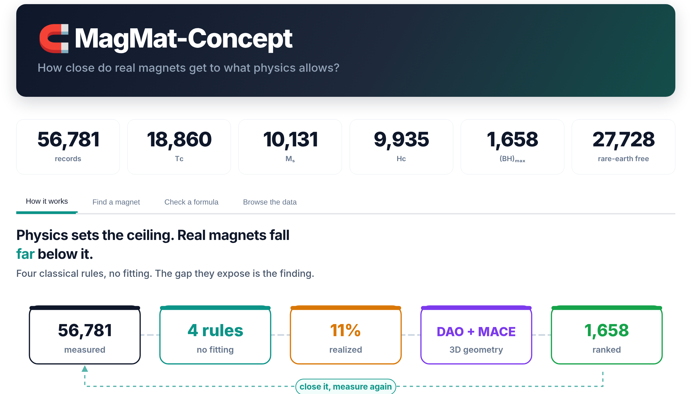

### How to Navigate the Studio:
- **Tab 1: Forward Screener & Physics Bounds:** Enter any chemical formula (or choose from 1-click presets like $\text{Nd}_2\text{Fe}_{14}\text{B}, \tau\text{-MnAl}, \text{FeNi}$). Instantly obtain trained ML predictions with conformal uncertainty, live 3D crystal lattices, and comparisons against the Slater-Pauling, Kronmüller, and Maxwell ceilings.
- **Tab 2: Physics Principles & Reality Gap:** Visual pedagogical walkthrough of the four analytical rules and interactive exploration of the 89% coercivity defect gap.
- **Tab 3: Inverse Target Discovery:** Set dynamic sliders for $(BH)_{\max}, T_C$, and rare-earth exclusion to screen viable sustainable candidates on the Pareto frontier.
- **Tab 4: Harmonized Data Explorer:** Filter and inspect the 56,781 experimental records, examining distributions and property coverage.

```bash
# Launch the web application
streamlit run app/app.py
```

---

## 9. Summary Cheat Sheet: Physics vs. Machine Learning

| Concept Layer | What It Provides | What It Does NOT Provide | Role in Discovery |
|---|---|---|---|
| **Analytical Ceilings** *(Slater-Pauling, Stoner, Kronmüller, Maxwell)* | Hard upper limits with **zero free parameters**; absolute boundaries grounded in condensed-matter theory. | Realistic polycrystal coercivity or actual transition temperatures. | Acts as an unbending guardrail: discards impossible proposals and quantifies headroom. |
| **Trained ML Models** *(Ensembles + Conformal Bounds)* | Accurate predictions of experimental properties ($T_C, T_N, M_s, H_c, K_1, (BH)_{\max}$) with 90% confidence intervals. | Extrapolation beyond physical plausibility without domain constraints. | Predicts real-world experimental properties and microstructural performance. |
| **3D Foundation AI** *(DAO Diffusion + MACE Transformer)* | Relaxed 3D crystal unit cells, thermodynamic stability ($E_{\text{hull}}$), and equivariant polymorph resolution. | Macroscopic magnetic hysteresis loops without coupling to ML. | Resolves the 89% defect gap by providing spatial and symmetry descriptors to the models. |
| **Inverse Design Engine** | Multi-objective Pareto optimization against application thresholds ($(BH)_{\max} \ge 120\text{ kJ/m}^3, T_C \ge 450\text{ K}$). | Automatic industrial-scale synthesis recipes. | Directs experimental synthesis toward high-probability, sustainable compositions. |
